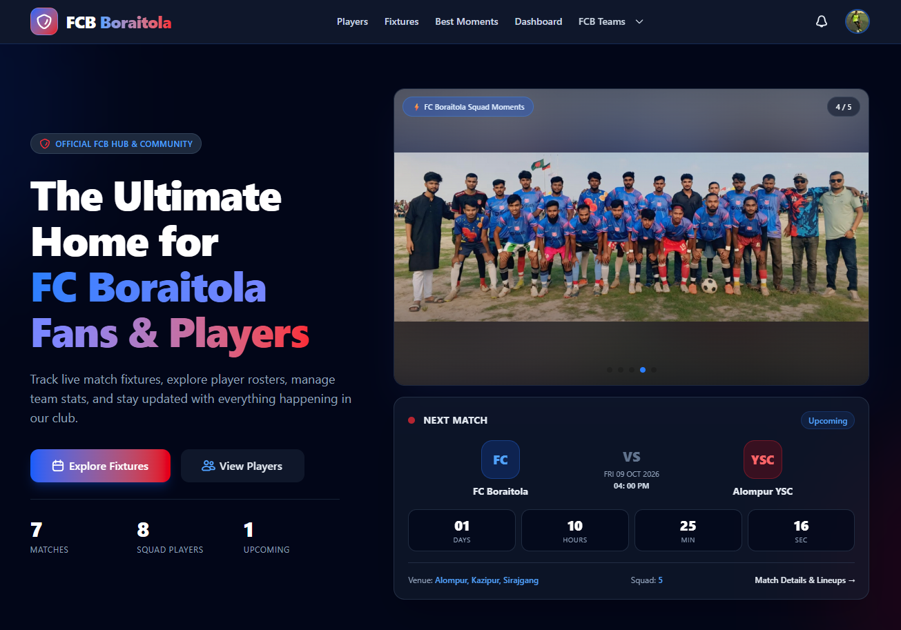
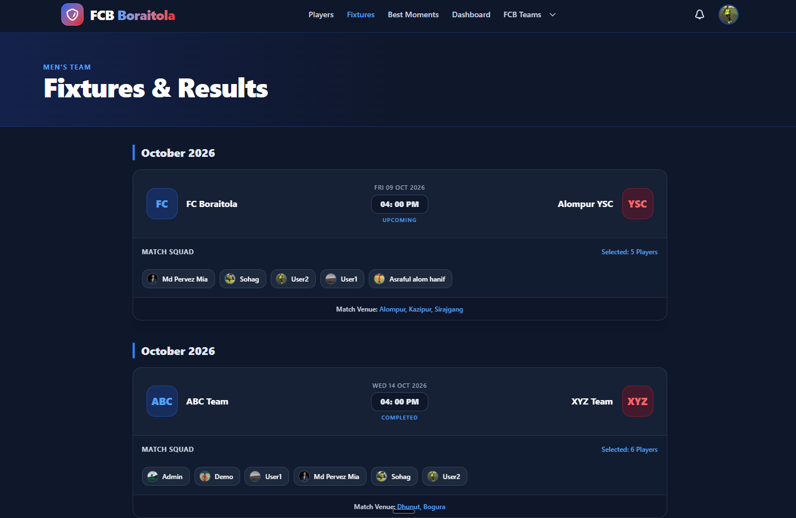
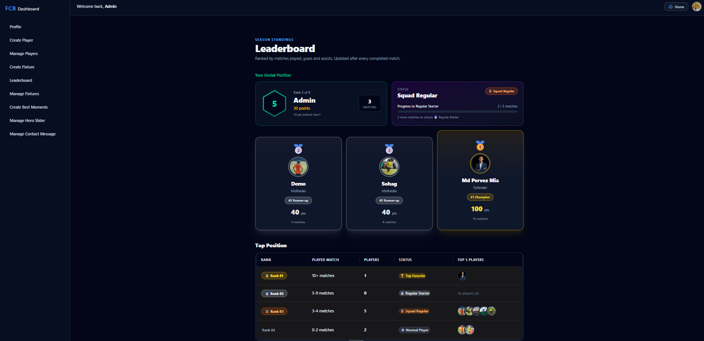
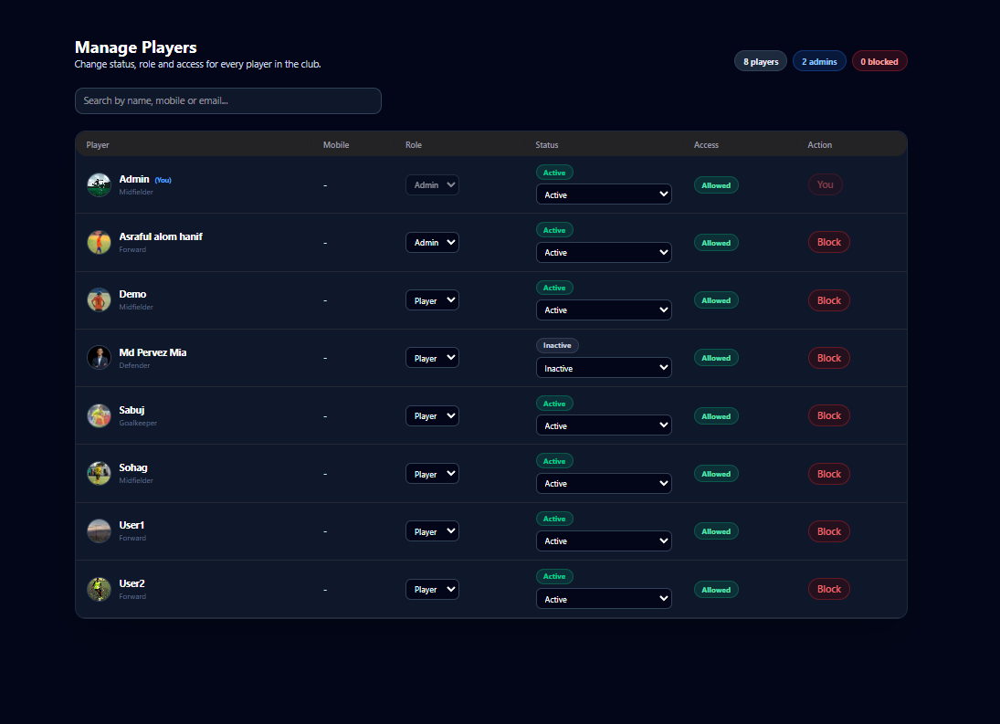

# FC Boraitola: Football Club Management Platform

A full-stack web platform for a local football club. It gives players, supporters and club admins one place to follow fixtures, manage match squads, track player rankings, receive notifications and contact the club.


## Live Links

| | Link |
|---|---|
| Live website | https://fcb-client.vercel.app/ |
| Backend API | https://fcb-server.vercel.app/ |
| Frontend repository | https://github.com/pervezmia/fcb-client |
| Backend repository | https://github.com/pervezmia/fcb-server |

## Screenshots

| Home | Fixtures & Squads |
|---|---|
|  |  |

| Leaderboard | Admin: Manage Players |
|---|---|
|  |  |

## Features

### For everyone
- **Home page** with a photo slider, live countdown to the next match (Bangladesh time) and animated club stats pulled from real data.
- **Fixtures & results** grouped by month, with the selected squad for every match.
- **Players directory** filtered by position, with detailed profiles showing status, squad number and matches played.
- **Leaderboard** with a podium for the top three, a rank table by player tier and a personal "Your position" card with progress to the next tier.
- **Best Moments** gallery of match highlights.
- **About** and **Contact** pages. The contact form stores messages in the database and is protected against spam.

### For players
- Sign up with email and password or Google.
- Create and edit a personal player profile.
- **Notification bell** in the navbar: players are notified when they are added to or removed from a match squad.
- **Rank tiers** earned by matches played: Squad Regular (3+), Regular Starter (5+) and Top Favorite (10+).

### For admins
- Create fixtures and update match status (Upcoming, Live, Completed, Cancelled).
- **Squad management** per match: select many players at once, only while the match is Upcoming.
- **Manage players**: change status (Active, Injured, Suspended, Inactive, Retired), switch role between player and admin, block and unblock accounts.
- **Hero slider library**: add photos, then choose which ones appear on the homepage.
- Publish best moments.
- **Messages inbox** for contact form submissions, with one-click reply by Gmail or WhatsApp.
- Styled confirmation dialogs for every destructive action.

## Tech Stack

| Layer | Technology |
|---|---|
| Framework | Next.js 16 (App Router, Server Components, Server Actions, Turbopack) |
| UI | React 19, Tailwind CSS 4, HeroUI v3, Gravity UI icons, Lucide |
| Animation and media | Framer Motion, Swiper |
| Notifications | react-hot-toast |
| Authentication | Better Auth (email and password, Google OAuth, JWT plugin) with the MongoDB adapter |
| Database | MongoDB Atlas |
| Backend API | Node.js, Express 5, MongoDB driver, jose (JWT verification), CORS (separate repository) |
| Tooling | ESLint, React Compiler |
| Hosting | Vercel (frontend and backend) |

## Architecture

```
Browser
   |
   v
Next.js app (Vercel)
   |-- Better Auth: sessions, Google and email login, issues JWTs
   |-- Reads:  server components call the REST API
   |-- Writes: Server Actions send the user's JWT to the API
   v
Express REST API (Vercel)  -->  MongoDB Atlas
   - verifies every JWT with the Better Auth JWKS endpoint
   - checks role and blocked status in the database on each request
```

**Authentication flow**

1. The user signs in through Better Auth.
2. For protected actions the client requests a short-lived JWT with `authClient.token()`.
3. A Server Action forwards the token to the Express API in the `Authorization` header.
4. The API verifies the signature against the JWKS endpoint, loads the user from the database, rejects blocked accounts and checks the role for admin routes.

## Project Structure

```
fcb-client/
├── src/
│   ├── app/                         # Routes (App Router)
│   │   ├── (auth)/                  # Login and register
│   │   ├── about/
│   │   ├── contact/
│   │   ├── best-moment/
│   │   ├── fixtures/
│   │   ├── players/
│   │   ├── fcb-teams/
│   │   ├── dashboard/
│   │   │   ├── admin/
│   │   │   │   ├── create-best-moments/
│   │   │   │   ├── fixture/
│   │   │   │   ├── manage-fixtures/
│   │   │   │   ├── manage-players/
│   │   │   │   ├── hero-images/
│   │   │   │   ├── leaderboard/
│   │   │   │   ├── messages/
│   │   │   │   └── profile/
│   │   │   └── player/
│   │   │       ├── create/
│   │   │       └── profile-edit/
│   │   ├── api/                     # Better Auth route handler
│   │   ├── layout.js
│   │   ├── loading.jsx
│   │   └── not-found.jsx
│   │
│   ├── components/
│   │   ├── common components/       # Hero banner, slider, countdown
│   │   ├── dashboard/               # Admin and player dashboard UI, sidebar, navbar
│   │   ├── fixtures/
│   │   ├── players/
│   │   ├── team/
│   │   ├── Share components/        # Navbar, footer
│   │   ├── ConfirmDialog.jsx        # Reusable confirmation dialog
│   │   ├── PlayerAvatar.jsx         # Reusable avatar with initials fallback
│   │   ├── TierBadge.jsx            # Rank badge
│   │   ├── NotificationBell.jsx
│   │   ├── Leaderboard*.jsx, Podium.jsx, TierTable.jsx, MyPositionCard.jsx
│   │   └── ContactForm.jsx
│   │
│   ├── hooks/
│   │   └── useNotifications.js      # Polling and read state for notifications
│   │
│   ├── lib/
│   │   ├── action/                  # Server Actions: all writes (admin/, player/)
│   │   ├── api/                     # Data fetchers: all reads
│   │   ├── core/                    # Backend URL, auth token helper
│   │   ├── motion/                  # Animation variants
│   │   ├── auth.js                  # Better Auth server config
│   │   ├── auth-client.js           # Better Auth client
│   │   ├── clubInfo.js              # Club address, email, social links
│   │   ├── leaderboard.js           # Scoring and ranking logic
│   │   ├── playerStatus.js          # Status list and colours
│   │   ├── playerTier.js            # Tier rules
│   │   ├── rankStyles.js
│   │   └── timeAgo.js
│   │
│   └── proxy.js                     # Route protection (Next.js proxy)
│
├── public/
├── next.config.mjs
├── postcss.config.mjs
├── eslint.config.mjs
└── package.json
```

## Data Model

| Collection | Purpose |
|---|---|
| `user`, `session`, `account`, `jwks`, `verification` | Managed by Better Auth. `user` also stores `role` and `isBlocked`. |
| `players` | Player profile, status, matches played, linked to a user account. |
| `fixtures` | Monthly groups. Each match has its status, teams, venue and `squad` array. |
| `notifications` | Per-player squad notifications with read state. |
| `hero-images` | Homepage slider photo library with an `isActive` flag. |
| `best-moments` | Highlight posts shown in the gallery. |
| `contact-messages` | Messages sent from the contact form. |

## Engineering Highlights

- **Clear separation of concerns.** Reads live in `lib/api`, writes are Server Actions in `lib/action`, and shared UI such as `ConfirmDialog`, `PlayerAvatar` and `TierBadge` is reusable.
- **Authorization checked against the database.** Roles and blocked status are read from the database on every request, so demoting or blocking a user takes effect immediately even if their token is still valid. Admins cannot change their own role or block themselves.
- **Idempotent statistics.** A `matchesCounted` flag makes sure a completed match increases each player's match count only once, even if the status is changed again.
- **Time zone safe dates.** Match dates are stored as readable text and parsed with a fixed UTC+6 offset, so the countdown is correct on servers running in UTC.
- **Spam protection without a third-party service.** The contact form uses a honeypot checkbox and a per-email rate limit on the API.
- **Configurable ranking.** Score is `matches x 10 + goals x 5 + assists x 3`, defined in one place (`lib/leaderboard.js`).
- **Resilient data fetching.** Every fetcher handles network and HTTP errors and falls back to an empty state instead of crashing the page.
- **Accessible, responsive UI.** Mobile-first dark theme, keyboard-friendly dialogs and sliders, and loading and not-found states.

## Getting Started

### Prerequisites
- Node.js 20 or later
- A MongoDB Atlas database
- A Google OAuth client (for Google sign-in)
- The backend running locally or deployed ([fcb-server](https://github.com/pervezmia/fcb-server))

### 1. Run the backend

```bash
git clone https://github.com/pervezmia/fcb-server.git
cd fcb-server
npm install
```

Create a `.env` file:

```env
PORT=5000
MONGO_DB_URI=your_mongodb_connection_string
BETTER_AUTH_URL=http://localhost:3000
```

`BETTER_AUTH_URL` must point to the frontend, because the API reads the JWKS from `/api/auth/jwks`.

```bash
npm run dev
```

### 2. Run the frontend

```bash
git clone https://github.com/pervezmia/fcb-client.git
cd fcb-client
npm install
```

Create a `.env` file:

```env
MONGO_DB_URI=your_mongodb_connection_string
BETTER_AUTH_URL=http://localhost:3000
BETTER_AUTH_SECRET=a_long_random_secret
GOOGLE_CLIENT_ID=your_google_client_id
GOOGLE_CLIENT_SECRET=your_google_client_secret
NEXT_PUBLIC_BACKEND_URL=http://localhost:5000
```

```bash
npm run dev
```

Open http://localhost:3000.

### 3. Create the first admin

New accounts start with the `player` role. Open the `user` collection in MongoDB and set `role` to `admin` for your account. After that, admins can promote other players from **Dashboard > Manage Players**.

## Scripts

| Command | Description |
|---|---|
| `npm run dev` | Start the development server |
| `npm run build` | Create a production build |
| `npm run start` | Run the production build |
| `npm run lint` | Lint the project with ESLint |

## Deployment

Both apps are deployed on Vercel. Add the same environment variables in the Vercel project settings, and set `BETTER_AUTH_URL` to the live frontend URL in both projects.

```bash
vercel --prod
```

## Roadmap

- Record goals and assists per match so they count in the leaderboard score.
- Send email notifications and in-dashboard replies to contact messages.
- Direct image upload for the hero slider and best moments.
- Block sign-in itself (not only API access) for blocked accounts.
- Automated tests for the ranking logic and API routes.

## Author

**Ahmed Pervez Kabir**

- GitHub: [@pervezmia](https://github.com/pervezmia)
- LinkedIn: [pervez-mia](https://www.linkedin.com/in/pervez-mia)

Feedback and suggestions are welcome. Feel free to open an issue.